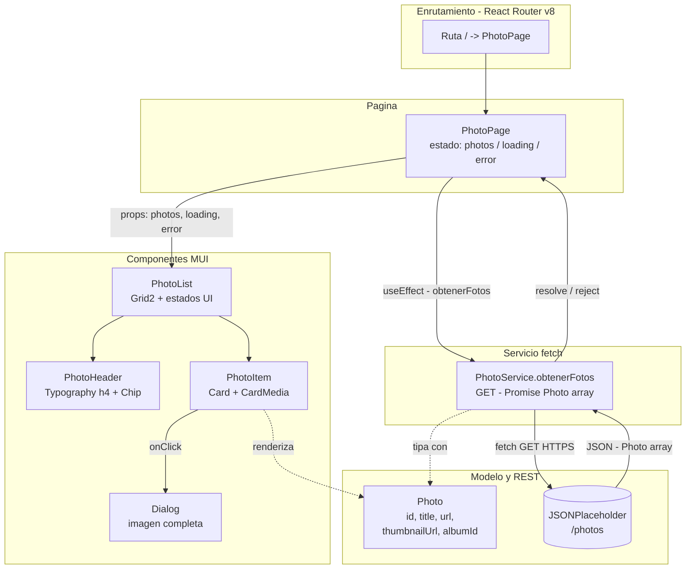
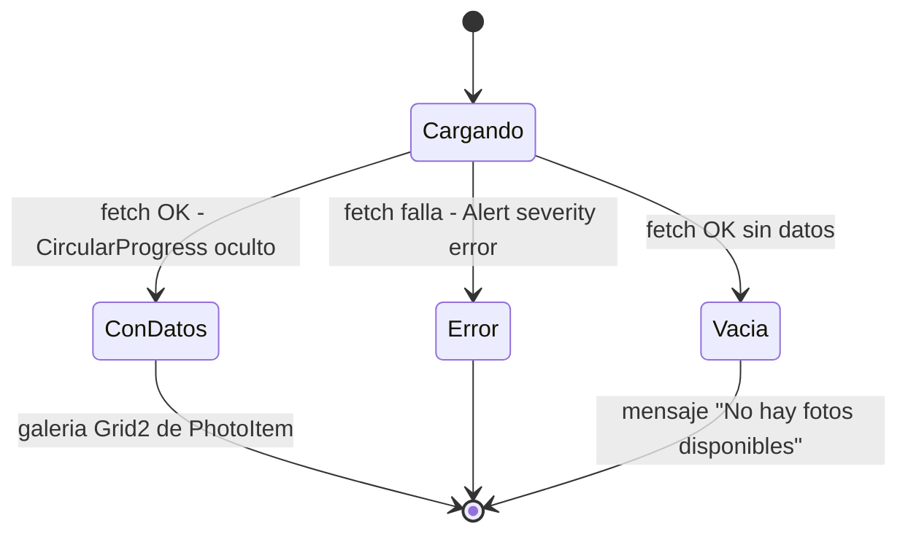

# clasereact20261001_1

Proyecto React para listar datos desde un servicio REST (JSONPlaceholder). Esta documentacion define la especificacion completa antes de escribir codigo.

## 📚 documentacion

| Capitulo | Documento | Descripcion |
|----------|-----------|-------------|
| 1 | [especificaciones.md](especificaciones.md) | 📋 Especificacion funcional: estructura del proyecto, modelo `Photo`, servicios, paginas y componentes con sus props y comportamiento. |
| 2 | [requerimientos.md](requerimientos.md) | 🛠️ Requerimientos tecnicos: React 19, React Router v8 (modo framework), TypeScript, MUI y librerias de pruebas. |
| 3 | [diseno.md](diseno.md) | 🎨 Diseno visual responsivo (mobile-first): tema MUI, tipografia, espaciado, estados visuales y accesibilidad. |
| 4 | [principio.md](principio.md) | 🧭 Principios de codigo: SRP, DRY, KISS y YAGNI como guias de implementacion. |
| 5 | [pruebas.md](pruebas.md) | ✅ Estrategia de pruebas: casos unitarios y de integracion con Vitest, React Testing Library y MSW. |
| 6 | [seguridad.md](seguridad.md) | 🔒 Seguridad del codigo: estandar OWASP Top 10 + ASVS Nivel 1 con checklist de verificacion. |

## 🚀 orden de lectura sugerido

1. `especificaciones.md` → que se va a construir
2. `requerimientos.md` → con que herramientas
3. `diseno.md` → como se ve
4. `principio.md` → como se escribe el codigo
5. `pruebas.md` → como se valida
6. `seguridad.md` → como se verifica la seguridad

## 🗺️ arquitectura y flujo del proyecto

### 🔄 estados de la UI (PhotoList)

